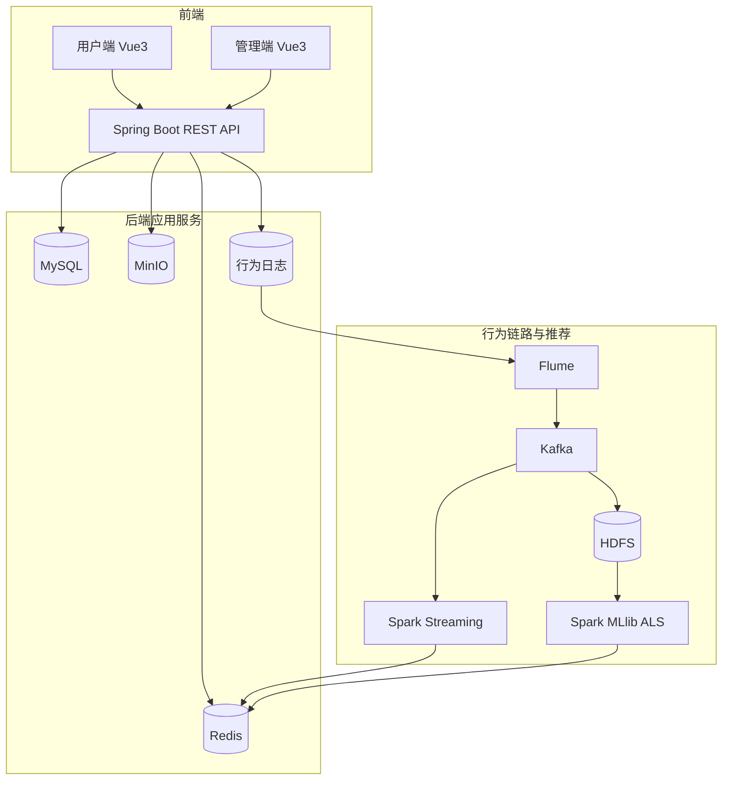

# 短视频分析推荐系统详细设计

- **版本:** v1.0
- **日期:** 2026-01-22
- **范围:** 全系统（前端+后端+数据+推荐+运维）
- **输入材料:** `docs/需求分析.md`、`docs/接口规范草案.md`、`docs/数据字典草案.md`、`helloagents/wiki/*`

---

## 1. 设计目标与范围

**目标:** 建立统一、可评审、可执行的系统级详细设计文档，覆盖架构、模块边界、数据流、接口、数据模型、测试与运维基线。

**范围内:** 用户端与管理端功能、后端 API 与数据模型、行为链路（Kafka/HDFS/Spark）、推荐与热门榜单、部署与运维策略。

**范围外:** 深度学习模型细节、跨地域多活架构、复杂风控审核与内容识别。

---

## 2. 架构概览

要点:
- 在线链路以 MySQL/Redis 为主，读缓存、写落库。
- 行为日志进入 Kafka，HDFS 作为原始归档与离线训练数据源。
- 推荐与榜单优先读取 Redis，未命中回落 MySQL 聚合。

---

## 3. 模块设计

### 3.1 前端用户端（frontend/user）
- **职责:** 登录注册、刷视频、互动操作、热门榜单、个性化推荐展示。
- **关键页面:** 登录/注册、视频流、视频详情、排行榜。
- **交互要点:** 播放触发行为采集；互动操作需要幂等提示与状态回显。

### 3.2 前端管理端（frontend/admin）
- **职责:** 视频审核、视频管理、用户管理、数据看板。
- **关键页面:** 视频列表与审核、用户列表、统计看板。

### 3.3 后端应用服务（backend）
- **Auth/User:** 注册、登录、邮箱验证码、用户冻结与解封。
- **Video:** 上传、审核、分页、详情、热门标记。
- **Interaction:** 点赞/收藏/评论/播放上报，强一致写库。
- **Recommendation:** 热门榜单与个性化推荐接口，缓存优先。
- **Stats:** 统计汇总、看板数据输出。
- **Storage:** MinIO 对象存储适配。
- **Log/Behavior:** 行为日志追加写入，提供大数据链路输入。

### 3.4 数据与存储
- **MySQL:** 交易数据与行为流水主库，保证一致性。
- **Redis:** 热门榜单、推荐结果、统计缓存与热点视频缓存。
- **MinIO:** 视频文件与封面对象存储。

### 3.5 行为链路与大数据（bigdata）
- **采集:** Flume Taildir 采集行为日志。
- **实时:** Kafka + Spark Streaming 生成实时统计写入 Redis。
- **离线:** HDFS 归档 + Spark MLlib ALS 生成离线 TopN。

---

## 4. 核心流程与数据流

1) **视频上传与审核**
- 管理端上传视频 → MinIO → DB 写入 `videos`（PENDING） → 审核通过后对外可见。

2) **播放与互动**
- 播放/点赞/评论/收藏 → 写入 `user_actions` + 更新计数 → 异步刷新 `video_stats`。

3) **热门榜单**
- 读取 Redis 热门列表 → 未命中回落 `video_stats` 计算 → 写回 Redis。

4) **推荐链路**
- 在线请求优先读取 Redis（实时/离线结果） → 未命中回落规则推荐 → 缓存回灌。

5) **看板统计**
- `daily_metrics` 输出趋势 → 管理端展示图表。

---

## 5. API 设计摘要

接口按模块分组，参考 `docs/接口规范草案.md`：
- **认证与用户:** /api/auth/*、/api/users/*
- **视频:** /api/videos/*、/api/admin/videos/*
- **互动:** /api/actions/*、/api/comments/*、/api/likes/*、/api/favorites/*
- **榜单与推荐:** /api/recommend/*、/api/hot/*
- **管理端:** /api/admin/users/*、/api/admin/dashboard/*

统一响应结构与错误码，用户端 Token 鉴权，管理端 Basic 鉴权。

---

## 6. 数据模型与索引策略

**核心表与关系:**
- `users` 与 `admin_users` 独立管理。
- `videos` 与 `video_stats` 一对一。
- `comments`、`video_likes`、`video_favorites` 与 `user_actions` 以 user_id/video_id 关联。

**索引策略:**
- 大表查询以 `user_id + time`、`video_id + time` 为主。
- 点赞/收藏表设置唯一索引 `UNIQUE(video_id, user_id)`，保证幂等。
- `video_stats` 作为热度与榜单计算基表，避免频繁 join。

**热度分建议:**
- `hot_score = a*play + b*like + c*comment + d*favorite`，权重可配置。

数据字典与字段明细以 `docs/数据字典草案.md` 与迁移脚本为准。

---

## 7. 缓存与一致性策略

- 写 DB 为准，缓存最终一致。
- 读路径优先 Redis，未命中回落 DB 并回填。
- 热门榜单与推荐列表设置 TTL，支持定时重算。
- 行为日志链路采用“至少一次”语义，后续计算侧做幂等处理。

---

## 8. 错误处理与幂等

- 统一错误码与异常拦截，区分参数错误/鉴权错误/业务冲突/系统异常。
- 幂等操作（点赞/收藏/关注）依赖唯一索引与重复写返回成功。
- 外部依赖失败（MinIO/Kafka/HDFS）采用重试与补偿机制。

---

## 9. 安全与合规

- 密码使用 bcrypt 存储。
- 管理端与用户端权限隔离。
- 上传文件类型/大小白名单校验。
- 行为与账号数据遵循最小化采集与脱敏策略。

---

## 10. 性能与容量

- 关键接口（推荐、榜单、视频分页）优先缓存。
- 支持分页与游标机制，避免全表扫描。
- 为后续扩展预留 Kafka/HDFS/Spark 资源容量规划。

---

## 11. 测试策略与报告

**模块测试与报告分离：**
- backend：单元/集成测试报告
- frontend/user：页面与接口联调报告
- frontend/admin：管理端联调报告
- bigdata：采集与落地一致性报告
- deploy：部署与启动验证报告

**压力测试：**
- 必须使用 JMeter 覆盖登录、视频分页、详情、互动、热门榜单、推荐接口。
- 输出 TPS、P95/P99、错误率与资源占用，形成独立性能报告。

---

## 12. 部署与运维

- **部署基线:** Docker Compose 编排 MySQL/Redis/MinIO/Backend。
- **链路扩展:** Kafka/HDFS/Spark 作为可选链路独立部署。
- **可观测:** 业务日志、审计日志、健康检查与告警指标。
- **备份:** MySQL 定期备份，Redis 持久化策略，MinIO 生命周期管理。

---

## 13. 风险与演进

- **风险:** 文档与实现偏差、行为链路未落地、性能基线不足。
- **缓解:** 明确“以代码与迁移脚本为准”，上线前完成压测与评审。
- **演进:** 规则推荐 → 协同过滤 → ALS/深度学习模型升级。
