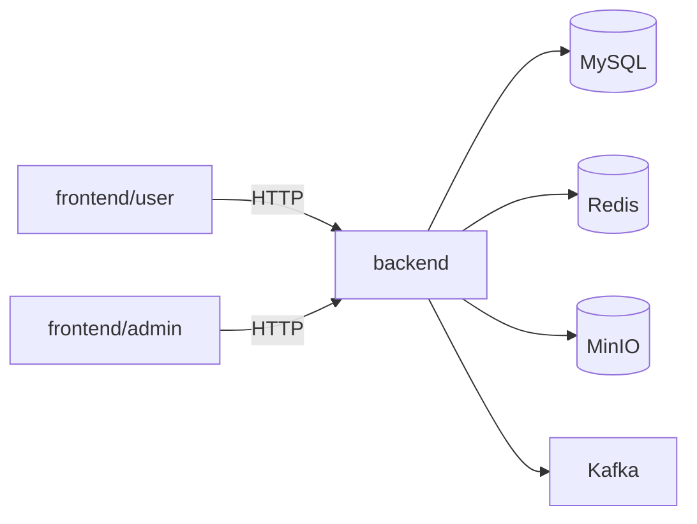

# 技术设计: M0 工程骨架与本地一键启动

## 技术方案

### 核心技术
- **后端:** Java 17 / Spring Boot / Spring MVC / MyBatisPlus（骨架）
- **前端:** Vue3 / Vite（骨架）
- **依赖服务:** MySQL / Redis / MinIO / Kafka（docker compose）

### 实现要点
- `deploy/docker-compose.yml` 提供统一服务编排，明确端口、卷与默认凭据（仅示例）。
- `backend/` 提供可编译可启动的最小工程：
  - 引入 MyBatisPlus 依赖与基础配置占位
  - 预留 datasource 配置（默认不强制连接数据库，避免 M0 因环境阻塞）
  - 提供健康检查：Actuator + 自定义 `/api/health`
- `frontend/` 提供两个最小 Vite 应用：`user` 与 `admin`
- `docs/` 增加占位草案文档，为后续 M1+ 的接口/数据设计提供落点

## 架构设计

## 架构决策 ADR

### ADR-001: M0 阶段后端不强制连库
**上下文:** M0 目标是“工程骨架可跑”，仓库当前缺少可运行代码与统一启动方式；若强制在启动时连库，会导致环境未就绪时无法启动，从而阻塞前端/接口联调与健康验证。
**决策:** 后端默认启用 datasource 占位配置，但启动阶段不强制验证数据库可用（仍可在后续里程碑切换为强制连库）。
**理由:** 降低 M0 失败概率，让“能跑起来”优先。
**替代方案:** 强制连接 MySQL 并在启动失败时退出 → 拒绝原因: 环境依赖尚未稳定，M0 验证成本更高。
**影响:** 需要在 README 中明确“数据库相关接口在 M1 才落地”。

## API设计

### GET /api/health
- **响应:** `{ "status": "ok" }`

### GET /actuator/health
- **响应:** Spring Boot Actuator 标准健康信息

## 数据模型
M0 不落地 DDL，仅在 `docs/数据字典草案.md` 占位，M1 再补齐可执行 DDL/迁移脚本。

## 安全与性能
- **安全:** docker compose 示例凭据仅用于本地开发；禁止提交真实密钥；MinIO/Kafka/MySQL 等默认暴露端口需在生产环境移除或内网化。
- **性能:** M0 不做性能优化，保证可启动与可验证为先。

## 测试与部署
- **测试:** `backend` 提供最小单测（Context loads/健康接口），前端提供 `npm run build` 验证构建。
- **部署:** 本地用 docker compose；后续可扩展 `deploy/` 脚本与 CI。

