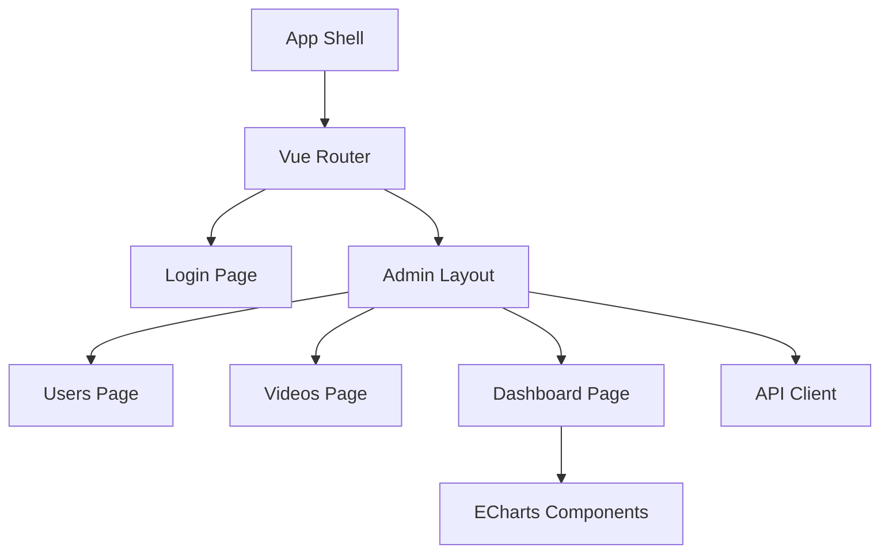

# 技术设计: M2.3 管理端前端（Vue3 + ECharts）

## 技术方案
### 核心技术
- Vue 3 + Vite + TypeScript
- Vue Router（前端路由）
- Element Plus（表格/表单/弹窗基础 UI）
- ECharts（数据可视化）

### 实现要点
- 路由结构：/login、/dashboard、/users、/videos
- API client：统一请求封装，支持 JSON 与 FormData
- 鉴权处理：token 本地存储 + 路由守卫 + 401 重定向
- 组件化：表格/分页/搜索、图表容器
- 运行配置：沿用 Vite proxy 方案，避免 Windows/WSL 直连问题

## 架构设计


## API 设计

### [POST] /api/auth/login
- **请求:** { "account": string, "password": string }
- **响应:** { "token": string, "user": { "id": number, "username": string } }

### [GET] /api/admin/users
- **请求参数:** page, size, keyword
- **响应:** { "records": User[], "total": number }

### [PATCH] /api/admin/users/{id}/status
- **请求:** { "status": number }
- **响应:** 空

### [POST] /api/admin/videos
- **请求:** FormData(uploaderUserId, title, description?, tags?, video)
- **响应:** Video

### [PATCH] /api/admin/videos/{id}/audit
- **请求:** { "status": string }
- **响应:** 空

### [PATCH] /api/admin/videos/{id}/hot
- **请求:** { "isHot": boolean }
- **响应:** 空

### [DELETE] /api/admin/videos/{id}
- **响应:** 空

### [GET] /api/videos/page
- **请求参数:** sort, page, pageSize
- **响应:** { "records": Video[], "total": number }

### [GET] /api/admin/analytics/daily-play
### [GET] /api/admin/analytics/user-growth
### [GET] /api/admin/analytics/hot-topn
### [GET] /api/admin/analytics/active-users
- **响应:** 图表数据数组

## 数据模型
```ts
type User = { id: number; username: string; email?: string; phone?: string; status: number };
type Video = { id: number; title: string; description?: string; uploaderUserId: number; auditStatus: string; isHot: boolean; createdAt: string; videoUrl?: string };
type ChartPoint = { date: string; value: number };
```

## 安全与性能
- token 存储在 localStorage，统一注入 Authorization
- 401 自动跳转登录页并清理 token
- 图表组件按需更新，页面切换时释放实例

## 测试与部署
- 本地运行：`cd frontend/admin` → `npm install` → `npm run dev`
- 环境变量：`VITE_PROXY_TARGET` 指向后端（默认 http://localhost:18080）
- 目标：保证最小可用 UI 与联调说明可直接使用
