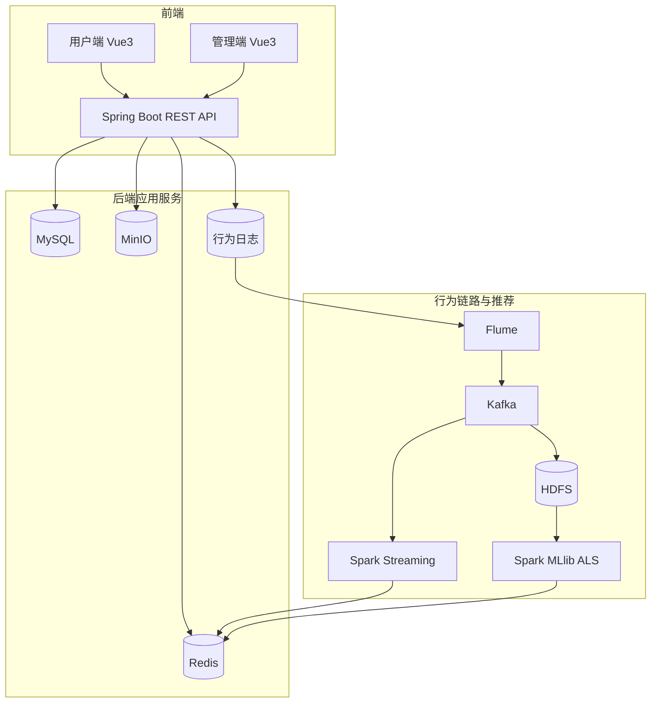

# 技术设计: 系统级详细设计文档

## 技术方案
### 核心技术
- Java 17 / Spring Boot 3.2.x / MyBatis-Plus / Flyway
- Vue 3 / Vite / TypeScript / Element Plus
- MySQL 8.0 / Redis 7 / MinIO
- Flume / Kafka / HDFS / Spark Streaming / Spark MLlib ALS

### 实现要点
- 以 `docs/需求分析.md`、`docs/接口规范草案.md`、`docs/数据字典草案.md` 作为输入材料，统一输出系统级详细设计文档。
- 架构描述包含 HDFS 行为链路与离线/实时计算路径。
- 数据库设计分析需覆盖交易表、行为流水表、统计汇总表与索引策略。
- 测试策略必须包含模块级测试报告与 JMeter 压力测试报告要求。

## 架构设计

## API设计
- 认证与用户、视频、互动、榜单、推荐、管理端接口按 `docs/接口规范草案.md` 进行一致性梳理。
- 统一响应结构与错误码规范，用户端 Token 与管理端 Basic 双体系并行。

## 数据模型
- 以 `docs/数据字典草案.md` 与迁移脚本为准。
- 重点关注 `user_actions`、`video_stats`、`daily_metrics` 与 `videos` 之间的统计与关联口径。

## 安全与性能
- **安全:** 文档中不输出明文密钥或生产账号；权限与鉴权策略明确边界。
- **性能:** 设定压测基线（QPS、P95、错误率），并在文档中明确 JMeter 压测策略。

## 测试与部署
- **测试:** 模块测试报告 + JMeter 压力测试报告必须分离归档。
- **部署:** 以 Docker Compose 为基线部署，HDFS/Kafka/Spark 作为可选链路标注。
