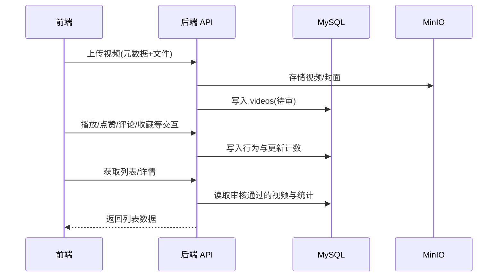
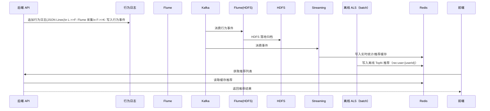

# 架构设计

> 本文为逻辑架构与技术选型的知识库视图；若与代码不一致，以代码与运行时行为为准。

---

## 总体架构

```mermaid
flowchart TD
  subgraph FE[前端]
    U[用户端 Vue3] -->|HTTP/JSON| API
    A[管理端 Vue3] -->|HTTP/JSON| API
  end

  subgraph BE[后端应用服务]
    API[Spring Boot REST API]
    API --> DB[(MySQL)]
    API --> R[(Redis)]
    API --> O[(MinIO)]
  end

  subgraph BD[大数据与推荐（规划）]
    L[行为日志文件] --> F[Flume]
    F --> K[Kafka]
    K --> F2[Flume(HDFS 落地)]
    F2 --> H[(HDFS)]
    K --> SS[Spark Streaming]
    SS --> R
    K --> ALS[Spark MLlib ALS]
    ALS --> R
  end
```

---

## 技术栈（已落地为主）

- **后端:** Java 17 / Spring Boot 3.2.x / Spring Security / MyBatis-Plus / Flyway
- **前端:** Vue 3 / Vite / TypeScript（ECharts 预留）
- **数据与存储:** MySQL / Redis / MinIO
- **大数据（规划）:** Kafka / Spark / Spark Streaming / MLlib ALS

---

## 核心流程

### 业务闭环（M1）



### 大数据链路（M3/M4）

说明：行为事件由后端追加写入本地日志文件（`app.behavior-log.path`），可通过 Flume TAILDIR 采集写入 Kafka `behavior-events`，同时由 Flume Kafka Source 落地到 HDFS 作为归档，再接 Streaming/ALS。



---

## 重大架构决策（ADR 索引）

完整 ADR 存储在各变更的 `helloagents/history/*/*/how.md` 中；此处仅维护索引（如需）。

| adr_id | title | date | status | affected_modules | details |
|--------|-------|------|--------|------------------|---------|
| ADR-001 | 采用项目内固定 Spark 发行版 | 2026-01-19 | ✅已采纳 | bigdata | ../history/2026-01/202601191222_fix_spark351_java17/how.md |
| ADR-002 | 评论互动数据存储 | 2026-01-20 | ✅已采纳 | backend/video | ../history/2026-01/202601201045_ui-admin-userfeed/how.md#adr-002-评论互动数据存储 |
| ADR-003 | 单视频切换与自动播放策略 | 2026-01-20 | ✅已采纳 | frontend/user | ../history/2026-01/202601201141_single-video-light/how.md#adr-003-单视频切换与自动播放策略 |
| ADR-004 | 以事务级重试处理 MySQL 死锁 | 2026-01-22 | ✅已采纳 | backend/video | ../history/2026-01/202601221920_jmeter-stability-fix/how.md#adr-001-以事务重试处理死锁采纳 |


