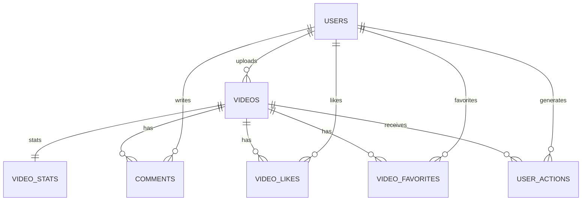

# 数据模型

> 以执行事实为准：本文件与迁移脚本 `backend/src/main/resources/db/migration/*` 保持一致。若不一致，以迁移脚本为准并更新本文件。

## 概述

M1 业务闭环的核心实体围绕：用户、视频、互动（点赞/收藏/评论）、行为流水、聚合统计与日维度看板指标。

- `video_likes` / `video_favorites` 用于“当前状态”；通过唯一键保证去重与幂等。
- `user_actions` 用于“行为事实”；追加写，便于后续统计与推荐链路接入。
- `video_stats` 用于“聚合计数”；计数更新走数据库原子自增/自减，避免并发丢失更新。

---

## 实体关系（已落地）

---

## 数据表（已落地）

> 字段与索引请以迁移脚本为准：`V1__init_schema.sql`。

### email_verification_codes

> 邮箱验证码最小实现：写入表 + 控制台打印；有效期 5 分钟；使用后 `used_at` 置为非空。

| 字段名 | 类型 | 约束 | 说明 |
|--------|------|------|------|
| id | bigint unsigned | PK | 主键 |
| email | varchar(128) | NOT NULL | 邮箱 |
| code | varchar(16) | NOT NULL | 验证码 |
| purpose | varchar(32) | NOT NULL | 用途（REGISTER） |
| expires_at | datetime(3) | NOT NULL | 过期时间 |
| used_at | datetime(3) |  | 使用时间 |
| created_at | datetime(3) | NOT NULL | 创建时间 |

### users

| 字段名 | 类型 | 约束 | 说明 |
|--------|------|------|------|
| id | bigint unsigned | PK | 用户ID |
| username | varchar(64) | UNIQUE | 用户名 |
| phone | varchar(32) | UNIQUE/NULL | 手机号 |
| email | varchar(128) | UNIQUE/NULL | 邮箱 |
| avatar_url | varchar(512) |  | 头像地址 |
| bio | varchar(255) |  | 个人简介 |
| password_hash | varchar(100) | NOT NULL | 密码哈希（bcrypt） |
| status | tinyint | NOT NULL | 1=正常，0=冻结（约定） |
| created_at | datetime(3) | NOT NULL | 创建时间 |
| updated_at | datetime(3) | NOT NULL | 更新时间 |

### admin_users

| 字段名 | 类型 | 约束 | 说明 |
|--------|------|------|------|
| id | bigint unsigned | PK | 管理员ID |
| username | varchar(64) | UNIQUE | 登录名 |
| display_name | varchar(64) |  | 显示名 |
| password_hash | varchar(100) | NOT NULL | 密码哈希（bcrypt） |
| status | tinyint | NOT NULL | 1=正常，0=禁用（约定） |
| created_at | datetime(3) | NOT NULL | 创建时间 |
| updated_at | datetime(3) | NOT NULL | 更新时间 |

### videos

| 字段名 | 类型 | 约束 | 说明 |
|--------|------|------|------|
| id | bigint unsigned | PK | 视频ID |
| uploader_user_id | bigint unsigned | FK(users.id) | 上传者 |
| title | varchar(200) | NOT NULL | 标题 |
| description | text |  | 描述 |
| video_url | varchar(512) | NOT NULL | MinIO object key（后端返回可访问 URL） |
| cover_url | varchar(512) |  | 封面URL（对象存储） |
| tags | json |  | 标签 |
| audit_status | varchar(32) | NOT NULL | 审核状态（约定） |
| is_hot | tinyint | NOT NULL | 是否热门 |
| created_at | datetime(3) | NOT NULL | 创建时间 |
| updated_at | datetime(3) | NOT NULL | 更新时间 |

### video_stats

| 字段名 | 类型 | 约束 | 说明 |
|--------|------|------|------|
| video_id | bigint unsigned | PK/FK(videos.id) | 视频ID |
| play_count | bigint unsigned | NOT NULL | 播放数 |
| like_count | bigint unsigned | NOT NULL | 点赞数 |
| comment_count | bigint unsigned | NOT NULL | 评论数 |
| favorite_count | bigint unsigned | NOT NULL | 收藏数 |
| hot_score | double | NOT NULL | 热度分 |
| updated_at | datetime(3) | NOT NULL | 更新时间 |

实现约定（代码事实）：
- 视频创建时初始化 `video_stats` 1 行。
- 计数更新使用 `UPDATE ... SET cnt = cnt + 1` 的 DB 原子写法；自减使用 `CASE WHEN cnt > 0 THEN cnt - 1 ELSE 0 END` 防止出现负数。

### comments

| 字段名 | 类型 | 约束 | 说明 |
|--------|------|------|------|
| id | bigint unsigned | PK | 评论ID |
| video_id | bigint unsigned | FK(videos.id) | 视频ID |
| user_id | bigint unsigned | FK(users.id) | 用户ID |
| content | text | NOT NULL | 评论内容 |
| like_count | bigint unsigned | NOT NULL | 点赞数 |
| created_at | datetime(3) | NOT NULL | 创建时间 |

### comment_likes

| 字段名 | 类型 | 约束 | 说明 |
|--------|------|------|------|
| id | bigint unsigned | PK | 点赞ID |
| comment_id | bigint unsigned | FK(comments.id) | 评论ID |
| user_id | bigint unsigned | FK(users.id) | 用户ID |
| created_at | datetime(3) | NOT NULL | 点赞时间 |

实现约定（代码事实）：
- `UNIQUE(comment_id, user_id)` 保证点赞幂等。

### video_likes / video_favorites

共同字段：`id`、`video_id`、`user_id`、`created_at`；共同约束：`UNIQUE(video_id, user_id)`。

实现约定（代码事实）：
- 点赞/收藏接口以关系表“影响行数”判定是否状态变化；仅在状态变化时更新 `video_stats` 与写入 `user_actions`。

### user_actions

| 字段名 | 类型 | 约束 | 说明 |
|--------|------|------|------|
| id | bigint unsigned | PK | 行为ID |
| user_id | bigint unsigned | FK(users.id) | 用户ID |
| video_id | bigint unsigned | FK(videos.id) | 视频ID |
| action_type | varchar(32) | NOT NULL | 行为类型（约定） |
| action_time | datetime(3) | NOT NULL | 行为发生时间 |
| duration_ms | bigint unsigned |  | 播放时长（可选） |
| is_completed | tinyint |  | 是否完播（可选） |
| created_at | datetime(3) | NOT NULL | 记录创建时间 |

action_type 约定（代码事实）：
- `PLAY`：播放
- `LIKE` / `UNLIKE`：点赞 / 取消点赞
- `FAVORITE` / `UNFAVORITE`：收藏 / 取消收藏
- `COMMENT`：评论

### behavior_events（日志）

> 行为日志采用 JSON Lines 输出，后端追加写入文件（默认 `./logs/behavior-events.log`，可通过 `app.behavior-log.path`/`BEHAVIOR_LOG_PATH` 配置）；如启用 Flume，可 taildir 采集写入 Kafka `behavior-events`。

| 字段 | 类型 | 说明 |
|--------|------|------|
| eventId | string | 事件唯一标识（UUID） |
| eventType | string | 行为类型（PLAY/LIKE/UNLIKE/FAVORITE/UNFAVORITE/COMMENT） |
| userId | number | 用户 ID |
| videoId | number | 视频 ID |
| actionTime | string | 行为时间（ISO 8601） |
| actionTs | number | 行为时间戳（毫秒） |
| durationMs | number | 播放时长（仅 PLAY） |
| isCompleted | boolean | 播放是否完成（仅 PLAY） |
| source | string | 事件来源（backend） |

---

## Redis（实时统计/热门榜，M3.2）

> 说明：本节描述 Redis 中用于实时统计的 key 约定；不涉及任何密码/连接串等敏感信息。

### stats:video:{videoId}（Hash）

字段约定：

- `play_count`（long）
- `like_count`（long）
- `comment_count`（long）
- `favorite_count`（long）
- `hot_score`（double）
- `updated_at_ms`（long）

### hot:videos（ZSET）

- member：`videoId`
- score：`hot_score`（double）

### daily_metrics

| 字段名 | 类型 | 约束 | 说明 |
|--------|------|------|------|
| day | date | PK | 自然日 |
| play_count | bigint unsigned | NOT NULL | 播放量 |
| like_count | bigint unsigned | NOT NULL | 点赞量 |
| comment_count | bigint unsigned | NOT NULL | 评论量 |
| favorite_count | bigint unsigned | NOT NULL | 收藏量 |
| active_user_count | bigint unsigned | NOT NULL | 活跃用户数 |
| new_user_count | bigint unsigned | NOT NULL | 新增用户数 |
| created_at | datetime(3) | NOT NULL | 创建时间 |
| updated_at | datetime(3) | NOT NULL | 更新时间 |

